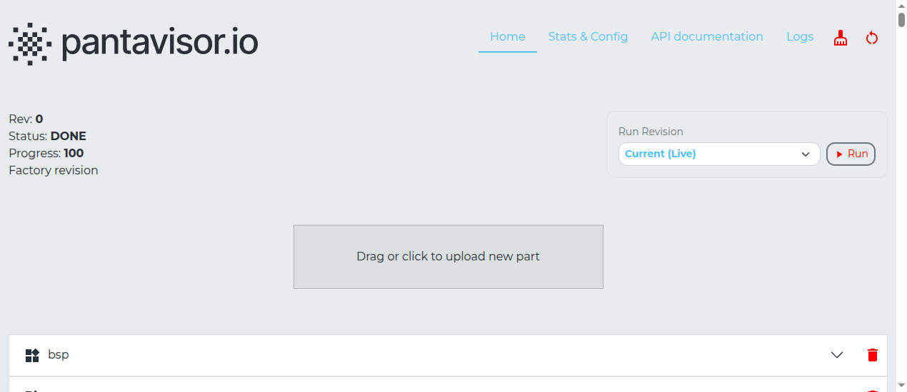

pvtx, Pantavisor's on-device update-transaction tool, serves a web UI that lets you upload a container package to a device using only a browser — no `pvr post` or direct network access to the pvr endpoint required. You still use the `pvr` CLI on your workstation to build the package, then transfer it via the browser.

**Prerequisites**: `pvr` installed on your workstation ([install guide](/meta-pantavisor/getting-started/develop/cli-tools/pvr-cli)) and the device reachable on the local network.

---

## 1 — Build the Container Package

On your workstation, create a fresh `pvr` project and add the container you want to install.

```bash
mkdir myapp-pkg
cd myapp-pkg
pvr init
```

Add the container from Docker Hub, setting `--platform` to match your device:

```bash
pvr app add myapp --from myorg/myapp:latest --platform linux/arm64
pvr add .
pvr commit -m "add myapp"
```

Export the project as a `.tar.gz` bundle that pvtx can consume:

```bash
pvr export myapp.tar.gz
```

This archive contains the container's SquashFS rootfs, its LXC config, and the revision metadata.

---

## 2 — Upload via pvtx

Open a browser and navigate to the device's local web UI:

```
http://<device-ip>:12368/app
```

1. Click **"Begin new transaction"** to open the update panel.
2. In the **"Drag or click to upload new part"** area, drop `myapp.tar.gz` or click to pick the file.

   

3. Commit the transaction from the toolbar to apply the change.

Pantavisor writes the uploaded container as a new pending revision and reboots. If the revision boots cleanly, it becomes the new permanent state.

---

## 3 — Verify

After the device reboots, check from the serial console or SSH:

```bash
lxc-ls -f
```

The new container should appear as `RUNNING`. You can also confirm in the pvtx UI revision history at `http://<device-ip>:12368/app`.

---

**Note**: If a debug shell appears on the serial console after the reboot, the device is waiting for confirmation before committing. Follow the on-screen instructions to proceed or roll back.