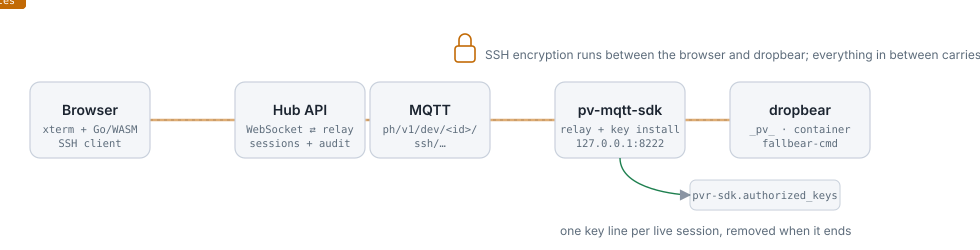
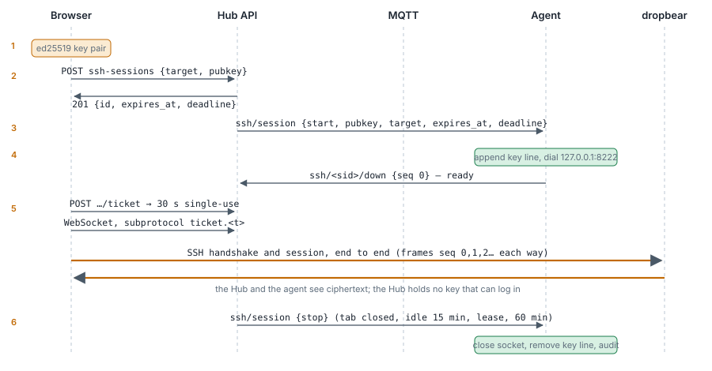

The **Terminal** tab on a device's Pantahub page opens a real SSH session to the device: a shell on the Pantavisor host, or inside any running container. The bytes travel over the MQTT connection the device already keeps with Pantahub, so it works wherever the device is, with no port open and no VPN. SSH itself runs between your browser and the SSH server on the device, so Pantahub relays ciphertext it cannot read and holds no key that could log in.

## What you need

- A device managed by the Pantahub MQTT agent (`pv-mqtt-sdk`) with web SSH support, connected to Pantahub over MQTT. The device page shows the connection state; the tab answers "Device is not connected over MQTT" otherwise.
- You must be the device's **owner**. A token used from a script or another app needs the full API scope or the dedicated `devices.ssh` scope; the general device scopes do not open terminals.
- Pantavisor's SSH server must be running (`PV_DEBUG_SSH`, on by default in development images). The tab warns when the device reports it disabled; the **Pantavisor control** tab can enable it.

## Using it

1. Open the device on [hub.pantacor.com](https://hub.pantacor.com) and choose **Terminal**.
2. The tab asks the device for its containers (the `LIST_CONTAINERS` command) and lists **Pantavisor (host)** plus every container, grouped by group, with its status. Only running containers can be opened.
3. Pick a target and press **Connect**.
4. On the first connection to a device from this browser, the tab shows the device's SSH host key fingerprint. Check it if you can (for example `ssh-keygen -lf` on the key under `/etc/dropbear` on the device, or `ssh-keyscan -p 8222 <device-ip>` from the local network) and press **Trust and connect**. The key is remembered per device; a **changed** key later shows a red warning and blocks until you accept it, because it may mean something sits between you and the device.
5. You get a shell: `_pv_` is Pantavisor's own root shell on the host; a container name drops you into that container's namespaces, the way `pventer` does on the serial console.

A session ends when you press **Disconnect**, close the tab, leave it idle for 15 minutes, or after 60 minutes. Keep the tab visible: the lease is renewed only while it is, and it runs out one minute after you switch away.

## How it works

The device side needs nothing new. Pantavisor already runs dropbear on port 8222, reads the keys it accepts from the user-meta key `pvr-sdk.authorized_keys`, and picks the target from the SSH user name (`_pv_` for the host, a container name for a container). The agent's container shares the host network, so it can reach `127.0.0.1:8222`.

1. The browser generates an ed25519 key pair for the session. The SSH client is [`golang.org/x/crypto/ssh`](https://pkg.go.dev/golang.org/x/crypto/ssh) compiled to WebAssembly; the private key lives in the WebAssembly module's memory and is never handed to the page.
2. `POST /devices/{id}/ssh-sessions` sends the target and the public key. Pantahub checks that you own the device, the scope, the limits, and writes the audit record.
3. Pantahub publishes a `start` notice on the device's own `ssh/session` topic. Only Pantahub can publish there.
4. The agent appends one line to `pvr-sdk.authorized_keys` for the session (with `no-port-forwarding,no-agent-forwarding,no-X11-forwarding`), connects to dropbear and answers with an empty first frame: ready.
5. The browser asks for a **ticket** (30 seconds, single use, bound to the session), opens the WebSocket with it, and the SSH handshake runs between the browser and dropbear. From here on every frame in both directions carries ciphertext, numbered so a lost frame ends the session rather than corrupting it. Your account token never enters the WebSocket handshake.
6. On stop, Pantahub publishes `stop`; the agent closes the connection and removes the key line; both sides record the end (who, which device and target, how long, how many bytes each way).

The wire contract is [`docs/ssh.md` in pv-mqtt-sdk](https://github.com/pantavisor/pv-mqtt-sdk/blob/main/docs/ssh.md).

## What each party can see

| Party | Holds |
|---|---|
| Browser | the private key (in WebAssembly), the plaintext, the device's host key fingerprint, your token |
| Hub API | who opened what, the public key, ciphertext frames for a minute at most, a ticket hash for 30 seconds |
| MQTT broker | ciphertext frames in flight and the session control messages |
| Agent | ciphertext, the public key it installs, the target name for its log |
| dropbear | the other end of the SSH connection: it decides which key may log in and which namespace the shell enters |

## Limits

| Limit | Value |
|---|---|
| Lease | 60 s, renewed every 20 s while the tab is visible |
| Idle | 15 min without a byte either way |
| Hard limit | 60 min per session |
| Concurrency | 2 live sessions per device, 3 per user |
| Start rate | 10 per device and 30 per owner a minute |
| Frame | 32 KiB; 256 KiB/s in each direction |

The device enforces its own copy of these limits, so a misbehaving Hub cannot talk it into more.

## Known limits

- The session key is written into the same `pvr-sdk.authorized_keys` every SSH server on the device reads, so while a session lives it is also accepted from the local network on port 8222 and by the `pvr-sdk` container's own SSH server on port 22. Using it needs the private key, which never leaves your browser.
- The target you pick is recorded in the audit, but dropbear picks the target from the SSH user name; a custom client could log in as another target. Only the owner can open a session, so this affects the audit, not who may get in.
- Trust on first use protects you from a Pantahub that tries to sit in the middle only if you check the fingerprint the first time and do not accept a changed key without a reason.

## Troubleshooting

| Message | Meaning |
|---|---|
| Device is not connected over MQTT | The agent is not connected right now; the device page shows when it was last seen. |
| This device already has 2 live SSH sessions | Stop one from the tab that holds it, or wait for its lease (60 s after that tab goes away). |
| The Hub refused the connection ticket | The ticket was used, expired or wrong; press **Connect** again. |
| The device refused the key | Pantavisor's SSH server did not accept the session key: SSH may be disabled, or `pvr-sdk.authorized_keys` may be too long for pv-ctrl (4 KiB). |
| Host key CHANGED | The device shows a different SSH host key than last time. Expected after a reflash; otherwise check before accepting. |
