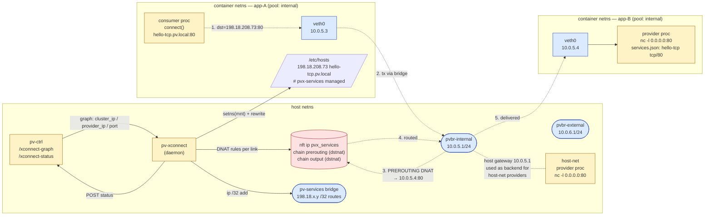

# xconnect Service-IP Layer

The service-IP layer turns named services declared in container manifests into addressable virtual IPs (`ClusterIPs`) reachable by hostname (`<service>.pv.local`) from inside any consumer container, regardless of which container instance currently provides the service.

This builds on top of the existing IPAM and xconnect infrastructure:

- **IPAM** allocates a stable per-container IPv4 from a named pool (the *backend IP*).
- **xconnect** mediates link establishment between providers and consumers.
- **Service-IP layer** adds: a deterministic ClusterIP per service name, a `pv-services` bridge that owns the ClusterIP /32s, an `inet pvx_services` nft table that DNATs ClusterIP-targeted traffic to the backend IP, and `/etc/hosts` injection so consumers resolve `<service>.pv.local` to the ClusterIP.

The model is intentionally close to Kubernetes Services: provider declares "I offer service X", consumer declares "I require service X", the runtime mints a stable virtual IP and DNS name. Backend container restarts don't change either; only the nft DNAT rule's target IP gets recomputed.

## Architecture and topology



**What lives where**

| Element | Lives in | Created by |
|---------|----------|------------|
| `pv-services` bridge + ClusterIP `/32`s | host netns | pv-xconnect on link establishment |
| `pvbr-<pool>` bridges | host netns | IPAM, on bridge setup |
| nft `ip pvx_services` table (PREROUTING + OUTPUT chains) | host netns | pv-xconnect on init |
| Per-link DNAT rule (mirrored across both chains) | host netns | pv-xconnect per `on_link_added` |
| Container veth (consumer / pool provider) | container netns | LXC + IPAM at platform start |
| `/etc/hosts` `<service>.pv.local` line | consumer mount ns | pv-xconnect via `setns(mnt)` |
| pv-ctrl `/xconnect-graph` and `/xconnect-status` | host netns | pv-ctrl process |

**Reachability paths (one diagram, four cases)**

The DNAT rule is installed in *both* `prerouting` and `output` chains so packets land on the rewrite regardless of where in the host kernel they originate. Backend resolution differs per quadrant:

| Provider | Consumer | Chain that fires | Backend |
|----------|----------|------------------|---------|
| Pool | Pool | `prerouting` (consumer veth → bridge) | provider's IPAM IPv4 |
| Host | Pool | `prerouting` (consumer veth → bridge) | consumer's pool gateway (10.0.5.1) — host-net provider listens on `0.0.0.0` |
| Pool | Host | `output` (consumer in host netns issues `connect()`) | provider's IPAM IPv4, routed back out the pool bridge |
| Host | Host | `output` | `127.0.0.1` (loopback) — host-net provider accepts on `lo` |

Pool consumers and host-net consumers share the same ClusterIP and the same DNS name; the only thing that varies is which nft chain catches the packet and which IPv4 the rule rewrites to.

## Two tiers

For each established link, xconnect picks one of two data planes:

### Tier 1 — kernel forward (zero-copy)

When provider and consumer are both TCP, an `inet pvx_services` PREROUTING rule rewrites `cluster_ip:port → backend_ip:port`. Conntrack handles the return path. Bytes never leave kernel space — appropriate for the embedded throughput targets this layer is designed for.

### Tier 2 — userspace proxy (cross-transport)

When transports differ (e.g. TCP-fronted but unix-socket-backed), xconnect binds a TCP listener on the bridge-owned ClusterIP and proxies bytes to the backend (`/proc/<pid>/root<socket>` for unix, `backend_ip:port` for TCP). Mirrors the existing `unix.c` / `rest.c` plugin shape; only the listener address (ClusterIP) and backend transport selection differ.

Selection happens automatically per link based on `provider_transport` / `consumer_transport` in `/xconnect-graph`.

## ClusterIP allocation

Deterministic from the service name via FNV-1a hash, mapped into a configurable subnet (default `198.18.0.0/15`, RFC 2544 benchmark range — chosen to avoid avahi/zeroconf fights with `169.254/16`, RFC1918 collisions with site networks, and Tailscale CGNAT (`100.64/10`) overlap). Same name → same ClusterIP across reboots, no on-disk allocator state.

Override via `pantavisor.config`:
```
xconnect.services.cidr=10.55.0.0/16
```
or env / kernel cmdline `PV_XCONNECT_SERVICES_CIDR=10.55.0.0/16`. The pantavisor daemon spawn path exports the configured value into `pv-xconnect`'s environment.

v2 (deferred) will add an explicit `services` block in `device.json`, parallel to IPAM's `pools` block, where service ranges, multi-backend policies (round-robin, weighted, failover), and per-service overrides live.

## DNS — static `/etc/hosts` injection

For each established link with a non-zero ClusterIP, xconnect enters the consumer's mount namespace (via `setns(2)`) and adds a `<service>.pv.local` entry to `/etc/hosts`. Writes are atomic via temp + `rename(2)`.

Managed entries live inside an explicit fenced block so user-authored content and append-blind tooling (Docker bridge setup, init scripts that do `echo … >> /etc/hosts`) stay clearly outside our territory:

```
<user content above — preserved verbatim>
# >>> pvx-services managed BEGIN — DO NOT EDIT INSIDE THIS BLOCK
# Lines between BEGIN and END are rewritten by pv-xconnect on every
# service reconcile. Add your own entries ABOVE the BEGIN line or
# BELOW the END line; both regions are preserved across reconciles.
198.18.208.73	hello-tcp.pv.local	# pvx-services managed
198.18.42.42	redis.pv.local	# pvx-services managed
# <<< pvx-services managed END — safe to append your own lines below
<user content below — preserved verbatim, including `>>`-appended lines>
```

The fences carry the user-facing contract (don't edit inside, edit freely outside). The per-line `# pvx-services managed` marker is kept inside the block so multiple services can be updated independently without rewriting siblings. The rewriter is self-healing: a missing BEGIN/END is fixed up on next reconcile; a truncated block (BEGIN without END) is closed cleanly. Anything outside the BEGIN/END pair, including content that arrived via `>> /etc/hosts` from another tool while we weren't looking, is copied through verbatim.

Failure of `/etc/hosts` injection — read-only filesystem, missing file, EPERM, setns fail — is treated as a **hard link establishment failure**: the link is marked unhealthy with `last_error` and stays in the retry queue. A consumer with broken DNS for a wired service is not a working consumer, and the failure is meant to drive pantavisor's standard rollback policy when the link belongs to a freshly-deployed revision. (The `/xconnect-graph/status` endpoint and `pv_platform_start` health gate that complete this loop are deferred to v1.1.)

## Network requirements for service participants

Any container that touches the service mesh — **provides** a service via
`services.json` *or* **requires** one via `services.required` — must declare
exactly one network anchor. Pantavisor never silently rewrites a container's
network configuration; if the manifest is ambiguous, the container is rejected
at parse time and the boot fails. In tryboot mode this triggers the standard
rollback path; in normal boot the revision continues degraded just as for any
other status-goal failure.

The matrix below lists every legal combination. "Brings own `lxc.net.*`" means
the container's `.conf` carries one or more `lxc.net.<n>.*` lines (typical for
host-net containers that need a specific veth/none/empty configuration).
"Pool declared" means the run.json has a `network: { pool: "<name>" }` block
(usually injected via `PV_NETWORK_POOL` in args.json).

| Brings own `lxc.net.*` | Pool declared | Network mode | Verdict | Backend resolution |
|------------------------|---------------|--------------|---------|--------------------|
| no  | yes  | (n/a)         | **OK** — IPAM pool member | provider's IPAM lease (consumer reaches via pool bridge) |
| yes | yes  | (anything)    | **REJECT** — pool participation requires no hand-rolled `lxc.net.*` (we will not strip the user's config) | — |
| yes | no   | host or absent| **OK** — host-net; container owns its netns config | provider's host IPv4 (or `127.0.0.1` for host↔host) |
| no  | no   | host or absent| **REJECT** — service participant must declare a network anchor; no implicit defaulting | — |

Containers that **do not** touch the service mesh are unaffected by this rule
— they may have any combination of `lxc.net.*` and pool / mode declarations
that suits them.

### Why these rules

- **No silent strip of `lxc.net.*`.** A container that hand-codes its veth or
  bridge configuration has done so deliberately; pantavisor pretending it's
  not there to slot in an IPAM lease would create a runtime mismatch users
  cannot debug from the manifest alone.
- **No implicit "default = host".** Earlier drafts considered defaulting a
  service participant with no network block to host-net. We rejected this:
  every service participant ends up with one of two well-defined network
  postures, and the choice is visible in source. A reader of the manifest
  always knows whether the container is host-net or pool-net without consulting
  pantavisor source.
- **Boot-fast failure beats runtime mystery.** Both rejections fire at parse
  time, before the platform is started. The same status-goal/rollback machinery
  that handles runtime readiness failures handles these.

### Reachability matrix (declared TCP services)

Once the rules above are met, every (provider, consumer) combination is
reachable via the ClusterIP front door:

| Provider | Consumer | Path |
|----------|----------|------|
| Pool | Pool | PREROUTING DNAT on consumer's bridge ingress → provider's IPAM IP |
| Host | Pool | PREROUTING DNAT on consumer's bridge ingress → consumer's pool gateway (host-net provider listens on `0.0.0.0`) |
| Pool | Host | OUTPUT-chain DNAT in host netns → provider's IPAM IP, routed out the pool bridge |
| Host | Host | OUTPUT-chain DNAT in host netns → `127.0.0.1` (loopback), provider's host listener accepts on lo |

The OUTPUT-chain path exists alongside PREROUTING in the `pvx_services` nft
table; see `xconnect/services_nft.c`.

## Manifest

Provider `services.json`:
```json
{
  "#spec": "service-manifest-xconnect@2",
  "services": [
    {"name": "hello-tcp", "type": "tcp", "port": 80}
  ]
}
```

Consumer `args.json`:
```json
{
  "PV_SERVICES_REQUIRED": [
    {"name": "hello-tcp", "type": "tcp"}
  ]
}
```

The `@2` spec adds `type: "tcp"` and the `port` field. `@1` (unix/rest/dbus/drm/wayland/input services with the `socket` field) continues to work unchanged — graph emission only adds the new ClusterIP fields when `svc_type == SVC_TYPE_TCP`.

## Code map

In pantavisor source:

| Path | Role |
|------|------|
| `xconnect/services.c` | ClusterIP hash + range parsing, env-var override |
| `xconnect/services_bridge.{c,h}` | `pv-services` bridge bring-up, `/32` add/remove, `ip_forward` enablement |
| `xconnect/services_nft.{c,h}` | `inet pvx_services` table + DNAT rules per Tier-1 link |
| `xconnect/plugins/tcp.c` | Plugin: kernel-forward fast path or userspace proxy |
| `xconnect/plumbing.c` | `pvx_helper_inject_hosts_entry` (mount-ns aware) |
| `xconnect/main.c` | Reconcile dispatch, failure semantics, hosts injection |
| `state.c:pv_state_get_xconnect_graph_json` | Graph emission with `cluster_ip`/`provider_ip`/transports |
| `parser/parser_system1.c` | `tcp` type + `port` field manifest parsing |
| `platforms.h` | `SVC_TYPE_TCP` enum, `port` field on `pv_platform_service_export` |
| `config.{c,h}` | `PV_XCONNECT_SERVICES_CIDR` config entry |
| `daemons.c` | env export to `pv-xconnect` on spawn |
| `utils/sysctl.c` | Shared `pv_sysctl_write()` helper (replaces `system("echo")` pattern) |

In meta-pantavisor:

| Path | Role |
|------|------|
| `recipes-containers/pv-examples/pv-example-svc-tcp-{provider,consumer}_1.0.bb` | Test container fixtures |
| `docs/testing/testplans/testplan-xconnect-services.md` | Test plan (TC-01 … TC-05 implemented; TC-06+ deferred) |

## Status

| Feature | v1 | v1.1 | v2 |
|---------|----|------|----|
| ClusterIP from service name | ✓ | | |
| `<service>.pv.local` DNS via /etc/hosts | ✓ | | |
| `pv-services` bridge + ClusterIP /32 | ✓ | | |
| Tier-1 nft DNAT (TCP→TCP) | ✓ | | |
| Tier-2 userspace proxy (cross-transport) | code in tree | wire consumer-side transport override in graph emission | |
| `last_error` sticky retry | ✓ | | |
| `/xconnect-graph/status` endpoint | | ✓ | |
| Platform health gate (`pv_platform_start`) | | ✓ | |
| Multi-backend policies | single backend, conflict rejected | | `services` block in device.json |
| Configurable CIDR | env + `pantavisor.config` | | per-pool in device.json |

## See also

- [testplan-xconnect-services.md](../testing/testplans/testplan-xconnect-services.md)
- [xconnect.md](xconnect.md) — base xconnect mediation (unix/dbus/drm/wayland)
- [ipam.md](ipam.md) — IPAM pools and bridge management
